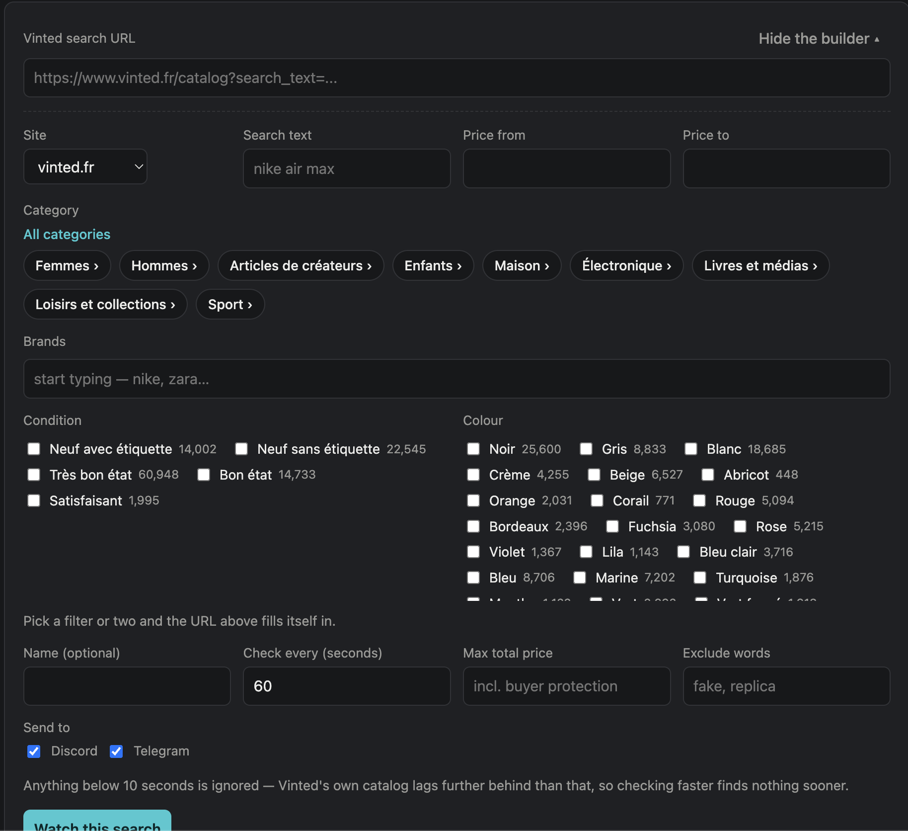
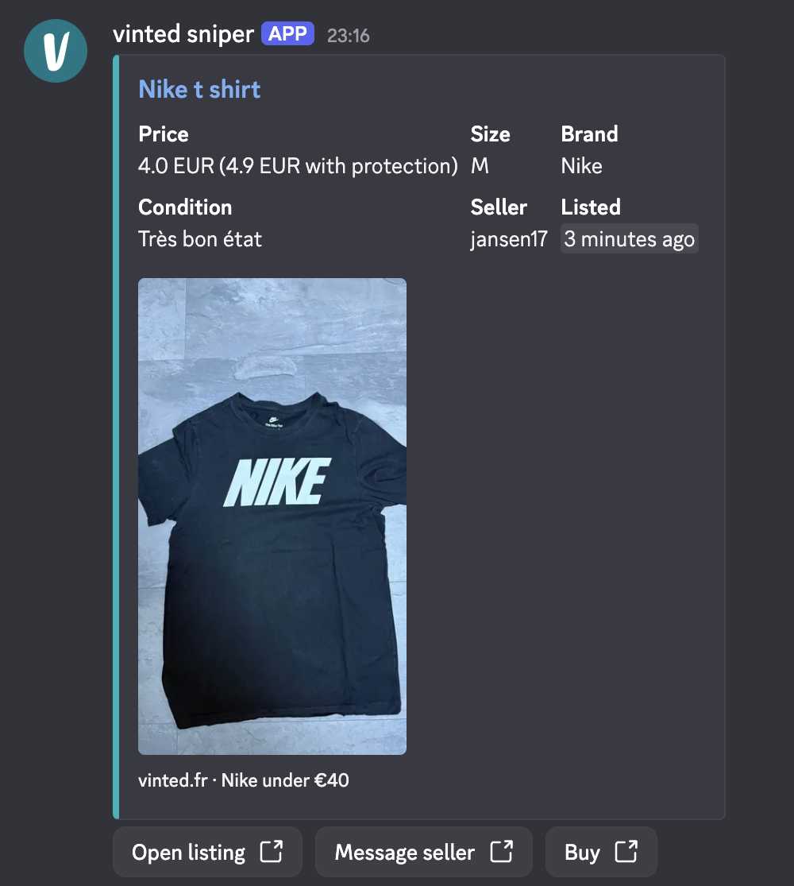
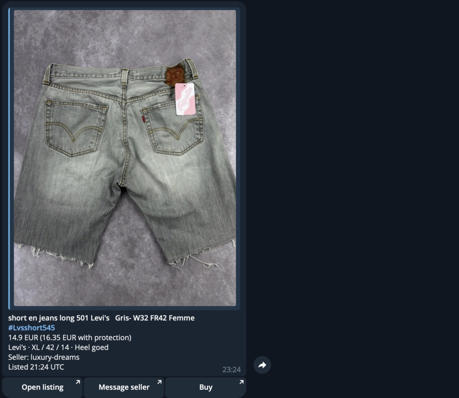

<div align="center">

**English** · [Français](README.fr.md)


[](https://github.com/jasp-nerd/vinted-sniper/actions/workflows/ci.yml)
[](https://github.com/jasp-nerd/vinted-sniper/pkgs/container/vinted-sniper)
[](https://www.python.org/)
[](LICENSE)

Watch a Vinted search and get a message when something new matches —<br>
in Telegram, Discord, or wherever else you want it.

</div>

You paste the URL of a search you already made on Vinted. It checks that search every minute
or so and tells you about listings that weren't there before. That's the whole idea.

<div align="center">
  
</div>

## Quickstart

1. Install [Docker Desktop](https://www.docker.com/products/docker-desktop/) (Linux: [Docker Engine](https://docs.docker.com/engine/install/)).
2. Download [docker-compose.yml](https://raw.githubusercontent.com/jasp-nerd/vinted-sniper/main/docker-compose.yml) (right-click, "Save link as...") into a folder.
3. Open a terminal in that folder and run `docker compose up -d`.
4. Open **http://localhost:8000**. Paste a Discord webhook and a Vinted search URL, or build the search right there.

That's it. No sign-in, no config file. Terminal version of steps 2 and 3:

```bash
curl -O https://raw.githubusercontent.com/jasp-nerd/vinted-sniper/main/docker-compose.yml
docker compose up -d
```

No Docker? It's a normal Python app (3.13+, [uv](https://docs.astral.sh/uv/)):

```bash
git clone https://github.com/jasp-nerd/vinted-sniper.git && cd vinted-sniper
uv sync --extra web && uv run vinted-sniper run
```

Alerts arrive while your computer is on and awake. For alerts around the clock, run it on a
Raspberry Pi, NAS or cheap VPS: see [the self-hosting guide](docs/self-hosting.md).

## Features

- **Filters on what you actually pay**, buyer protection included. Vinted's own price filter ignores it.
- **Tells you when it stops working.** A watchdog spots a search going silent and fixes the session itself.
- **No Vinted account, no login, no cookies.** Nothing for Vinted to restrict.
- **Search builder in the dashboard**: Vinted's own categories, brand autocomplete and filters, with live counts.
- **Quiet on the first run.** No opening flood of ninety-six old listings.
- **Discord, Telegram, ntfy, RSS, or plain JSON webhooks**, with per-search routing.
- **Every country site**: `vinted.fr`, `.de`, `.nl`, `.co.uk`, `.com`, and the rest.

## Screenshots

<div align="center">
  
  <br><sub>The search builder</sub>
  <br><br>
  
  <br><sub><b>Discord</b> — one rich card per listing, stacked into embeds when several land at once</sub>
  <br><br>
  
  <br><sub><b>Telegram</b> — photo as a preview, so the message keeps its buttons</sub>
</div>

## Docs

- [Configuration](docs/configuration.md): every setting, the CLI, notification channels, and the dashboard password for remote access. Nothing is required to start.
- [Self-hosting](docs/self-hosting.md): Raspberry Pi, NAS, VPS, updating, backups.
- [Troubleshooting](docs/troubleshooting.md): nothing arrives, 403s, and the one-line test that shows whether your IP is blocked.
- [Architecture](docs/architecture.md) and [REVIEW](docs/REVIEW.md): for working on the code.

Not affiliated with Vinted. It reads public listings anonymously and never logs in, buys, or
lists; Vinted's terms prohibit automated access, so running it is your own call. More in
[docs/legal.md](docs/legal.md).

MIT licensed. Contributions welcome — especially bug reports with logs attached.
